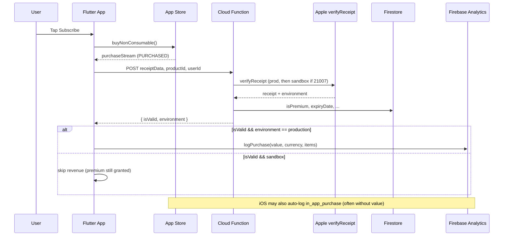

# In-App Purchase Analytics & Revenue (Firebase GA4)

This document explains **how subscription purchases are tracked**, **when revenue is reported to Google Analytics**, and **why GA4 can show `in_app_purchase` events with $0 revenue**.

Related code:

- Client IAP + revenue: `lib/services/subscription_iap_service.dart`
- Revenue policy: `lib/services/subscription_revenue_policy.dart`
- Backend verification: `functions/index.js` (`verifyAppleSubscription`)
- General integrations: [INTEGRATIONS.md](INTEGRATIONS.md)

---

## Quick summary

| What happens | Premium granted? | Firebase revenue logged? |
|---|---|---|
| Purchase verified (any environment) | Yes | Only if `environment == "production"` |
| Sandbox / TestFlight / StoreKit test | Yes | **No** (intentional) |
| Apple verify fails → DEV fallback | Yes | **No** (`environment: "sandbox"`) |
| Restore purchase | Yes | **No** (restore never calls `logPurchase`) |

**Important:** Revenue is sent as the GA4 event **`purchase`**, not **`in_app_purchase`**. Those are different events.

---

## End-to-end flow



### Step-by-step

1. **User buys** on the Premium screen → `SubscriptionIAPService.buy()`.
2. **StoreKit** returns `PurchaseStatus.purchased` on `purchaseStream`.
3. **Backend verify** — app POSTs to `CLOUD_FUNCTION_URL` (`verifyAppleSubscription`) with:
   - `receiptData`, `productId`, `userId`, optional `fcmToken`
4. **Cloud Function** verifies with Apple, writes `Users/{userId}` in Firestore, returns:
   ```json
   { "isValid": true, "environment": "production" | "sandbox" }
   ```
5. **If valid** — app grants premium locally + refreshes Firestore listener.
6. **If valid AND production** — app calls `FirebaseAnalytics.instance.logPurchase(...)`.
7. **`completePurchase`** — finishes the transaction with the store.

---

## Firebase events: `purchase` vs `in_app_purchase`

### `purchase` (revenue event — logged by our app)

Logged manually in `_reportSubscriptionRevenueToFirebase()` when:

- Backend says `isValid: true`
- `shouldReportSubscriptionRevenue(environment)` is true (`environment == "production"`)

Parameters sent:

| Parameter | Source |
|---|---|
| `value` | `product.rawPrice` |
| `currency` | `product.currencyCode` |
| `transaction_id` | `purchaseDetails.purchaseID` |
| `items[]` | product id, title, price, category `subscription` |

**In GA4:** Reports → Monetization → **Purchase revenue**, or Events → **`purchase`**.

### `in_app_purchase` (automatic iOS event — not from our revenue code)

On iOS, Firebase / StoreKit can log **`in_app_purchase`** automatically when a transaction completes. This is **not** the same as our `logPurchase()` call.

- Often logged **without** `value` / `currency`
- Shows up in Events with event count, but **Purchase revenue stays $0**
- Our app does **not** call `logInAppPurchase()` or `logTransaction()` today

**If you see 2 users and 2 `in_app_purchase` events but $0 revenue**, that usually means:

1. You are looking at **`in_app_purchase`**, not **`purchase`**, or
2. Purchases were **sandbox/test** and our app correctly skipped `logPurchase()`.

---

## Revenue policy (sandbox vs production)

```dart
// lib/services/subscription_revenue_policy.dart
bool shouldReportSubscriptionRevenue(String? environment) {
  return environment == 'production';
}
```

### When backend returns `sandbox`

| Scenario | Why |
|---|---|
| Apple status `21007` | Receipt is sandbox; function retries sandbox URL |
| Apple `environment: "Sandbox"` | Test / Sandbox Apple ID |
| DEV fallback after verify failure | `isFallback: true` → always `sandbox` |

Sandbox purchases **still unlock premium** in the app. They **must not** inflate Analytics revenue.

### When backend returns `production`

Real App Store purchase verified against production `verifyReceipt` with `environment: "Production"`.

Only then does the client call `logPurchase()`.

---

## Restore purchases

`PurchaseStatus.restored` flow:

- Verifies with backend (`isRestore: true`)
- Grants premium if valid
- **Does not** call `_reportSubscriptionRevenueToFirebase()`

Restores are not new revenue.

---

## Where to look in Google Analytics 4

| Goal | Where |
|---|---|
| Revenue | Reports → Monetization → Overview / Ecommerce purchases |
| Revenue event | Explore → Events → filter **`purchase`** |
| Auto iOS event (no revenue) | Events → **`in_app_purchase`** |
| Event parameters | DebugView (debug build) or Events → `purchase` → parameters `value`, `currency` |

Allow **24–48 hours** for standard reports. Use **DebugView** + Xcode console for immediate verification.

---

## Debugging (Xcode / device logs)

Search for `[SubscriptionIAP]`:

| Log message | Meaning |
|---|---|
| `verification isValid=true environment=production reportRevenue=true` | Revenue should be logged |
| `skipping Firebase revenue (environment=sandbox)` | Premium OK, revenue skipped |
| `logged product=... value=... USD` | `logPurchase` succeeded |
| `product not found for ...` | `_products` empty — revenue skipped (query products failed) |
| `_verifyPurchaseWithBackend: CLOUD_FUNCTION_URL missing` | No verify → no premium, no revenue |

### Test checklist

1. **Production purchase** — real App Store install (not TestFlight sandbox tester flow if you need revenue in GA).
2. Confirm Cloud Function returns `"environment": "production"`.
3. Confirm log: `_reportSubscriptionRevenueToFirebase: logged product=...`.
4. In GA4, check event **`purchase`** (not `in_app_purchase`).
5. Enable Analytics DebugView on device for live events.

---

## Code reference

### Client: when revenue is logged

```dart
// subscription_iap_service.dart — after successful PURCHASED + verify
if (verification.reportRevenue) {
  await _reportSubscriptionRevenueToFirebase(purchaseDetails);
} else {
  debugPrint('skipping Firebase revenue (environment=...)');
}
```

### Client: logPurchase payload

```dart
await FirebaseAnalytics.instance.logPurchase(
  currency: product.currencyCode,
  value: product.rawPrice,
  transactionId: transactionId,
  items: [AnalyticsEventItem(...)],
);
```

### Backend: environment resolution

```javascript
// functions/index.js
function resolveSubscriptionEnvironment(data, usedSandbox, { isFallback = false } = {}) {
  if (isFallback) return "sandbox";
  const appleEnv = data?.environment?.toLowerCase() ?? "";
  const isSandbox = usedSandbox || appleEnv === "sandbox";
  return isSandbox ? "sandbox" : "production";
}
```

---

## FAQ

### Subscription complete hoti hai, premium milta hai, lekin GA4 revenue $0?

1. GA4 mein **`in_app_purchase`** dekh rahe ho — revenue **`purchase`** event mein aati hai.
2. Purchase **sandbox/test** thi — app ne jaan boojh kar revenue skip ki (premium phir bhi milta hai).
3. Apple verification fail → **DEV fallback** — premium milta hai, `environment: sandbox`, revenue nahi.

### Kya TestFlight purchases revenue mein count hoti hain?

Generally **nahi**. TestFlight uses sandbox receipts → backend returns `sandbox` → client skips `logPurchase()`.

### Restore par revenue kyun nahi?

Restore existing subscription hai, nayi purchase nahi. Code restore path par `logPurchase` call nahi karta.

### Adapty / GameAnalytics?

- **Adapty** — profile sync after purchase (`AdaptyService.syncAfterPurchaseOrRestore()`); not GA4 purchase revenue.
- **GameAnalytics** — design/lifecycle events via `GameAnalyticsService`; separate from Firebase `purchase`.

---

## Future improvements (optional)

Not implemented today; consider if GA4 reporting needs to change:

- iOS `FirebaseAnalytics.instance.logTransaction(transactionId)` for StoreKit 2 auto-enriched events
- Separate test flag to log sandbox revenue in **debug builds only**
- Log custom dimension `purchase_environment` on a non-revenue debug event for easier GA4 filtering
